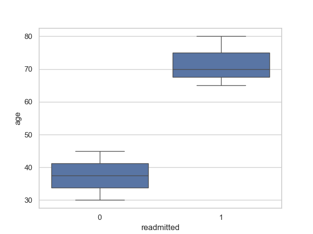
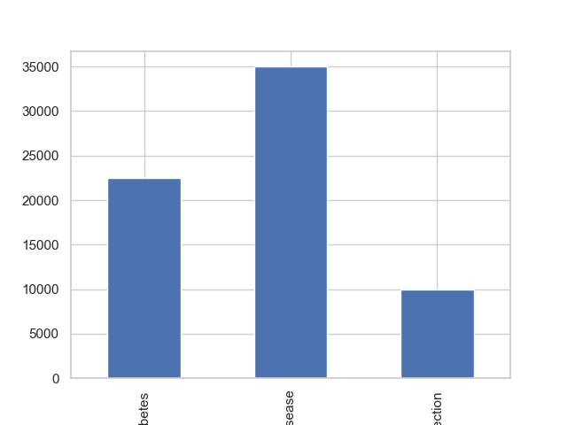
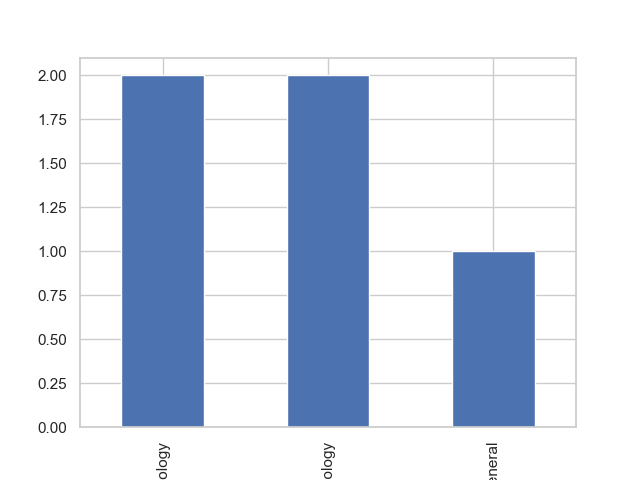
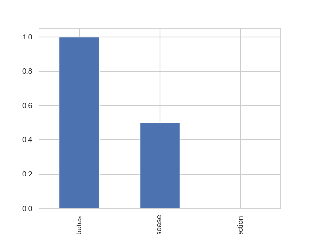

# MediFlow-Cloud

##  Project Overview

MediFlow-Cloud is a healthcare analytics project that analyzes patient data to uncover insights related to readmissions, treatment costs, and hospital performance.

The project combines **Python-based data analysis** with **interactive Tableau dashboards** to help healthcare providers make data-driven decisions.

---

## 🎯 Objectives

* Analyze patient readmission patterns
* Identify cost distribution across treatments
* Understand demographic trends (age, city)
* Visualize healthcare data using dashboards

---

##  Tech Stack

* **Python** (Pandas, Matplotlib)
* **Tableau Public**
* **AWS (S3, Athena)** *(conceptual integration)*

---

## Key Features

* 📈 Age-wise patient analysis
* 🌍 City-wise patient distribution
* 💰 Treatment cost analysis
* 🏥 Department-level insights
* 🔁 Readmission rate tracking
* 📊 Interactive dashboard visualization

---

## Project Structure

```
MediFlow-Cloud/
│
├── data/
│   └── patient_data.csv
│
├── scripts/
│   └── analysis.py
│
├── outputs/
│   ├── age.png
│   ├── city.png
│   ├── cost.png
│   ├── department.png
│   └── readmission.png
│
├── dashboard/
│   └── MediFlow-Cloud.twbx
│
└── README.md
```

---

## Output Visualizations

### Age Analysis



### City Distribution


### Cost Analysis



### Department Insights



### Readmission Analysis



---

## 🌐 Tableau Dashboard
Here is the dashboard link:
🔗 https://public.tableau.com/views/MediFlow-Cloud/Dashboard1?:language=en-US&:sid=&:redirect=auth&:display_count=n&:origin=viz_share_link

---

## ☁️ Cloud Integration (Concept)

This project is designed with cloud scalability in mind:

* Data can be stored in **AWS S3**
* Queried using **AWS Athena**
* Processed using **Python scripts**

---

## 🚀 How to Run the Project

### 1️⃣ Clone the Repository

```
git clone https://github.com/UzmaTania1/MediFlow-Cloud.git
cd MediFlow-Cloud
```

### 2️⃣ Install Dependencies

```
pip install pandas matplotlib
```

### 3️⃣ Run the Analysis

```
python scripts/analysis.py
```

---

## 💼 Use Case

This project helps healthcare organizations:

* Reduce patient readmissions
* Optimize operational costs
* Improve decision-making using data insights


## ⭐ Acknowledgment

This project demonstrates an end-to-end data analytics workflow including:

* Data preprocessing
* Exploratory Data Analysis (EDA)
* Data visualization
* Dashboard creation

